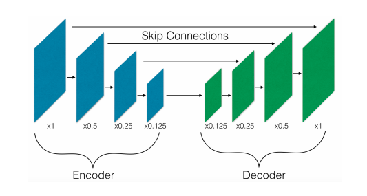
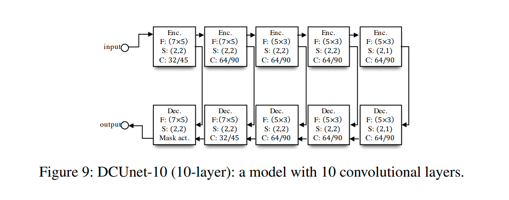

# [Jupyter Notebook](https://github.com/pheepa/DCUnet/blob/master/dcunet.ipynb) #

# Phase-aware speech enchancement with Deep Complex U-Net #
Для изучения я выбрал статью ["Phase-aware speech enchancement with Deep Complex U-Net"](https://openreview.net/pdf?id=SkeRTsAcYm), в которой описывается архитектура и обучние сверточной нейронной сети для улучшения речи, так называемого денойзинга, и поставил эксперимент. 

## Задача ##
Оновная задача состоит в разработке комплексной вариации архитектуры известной U-Net сети для устранения шума из аудио.

## Особенность метода ##
Ее особенность и отличие от остальных сетей, например SegNet, для семантической сегментации(и не только) закоючается в Skip-Connections и в том, что значения как входных данных, так и всех параметров сети(фильтры свертки и тд.) являются комплексными.

### Skip-Connections ###
Основная идея заключается в том, что ранние слои Encoder'ов конкатятся с "паралленьными" им слоями Decoder'ов.

### Маска ###
В результате слоев свертки мы получаем маску, которую домножаем на входной time-frequency сигнал с шумом и получаем очищенный опять же time-frequency сигнал, который далее проходит обратное оконное преобраование Фурье.
 

### Альтернативные решения ###
* [Improved Speech Enhancement with the Wave-U-Net](https://arxiv.org/abs/1811.11307)

## Эксперимент ##
Для обучения будем использовать [Noisy speech database for training speech enhancement algorithms and TTS models](https://datashare.is.ed.ac.uk/handle/10283/2791), который содержит набор данных для обучения и тестирования с 28 и 56 спикерами в .wav аудиофайлах 48 КГц. Будет реализована именно 10-слойная архитектура сети, которая выглядит следующим образом:

Будет продемонстрирован график изменения значения функции потерь при обучении и валидации. 

Так же будет расчитана PESQ метрика.

### Проблемы ###
Так как я не имею оборудования с достаточным GPU(в наличии ноутбук с 2 Гб и модель не помещается в память, не говоря уже об обучении) мне пришлось рассмотреть альтернативы для обучения:

* Обучить на Google Colab или другом облачном сервисе.
Облачные сервиса имеют строгие ограничения по времени сессии, поэтому было принято решение обучить на маленьком количестве эпох. 
